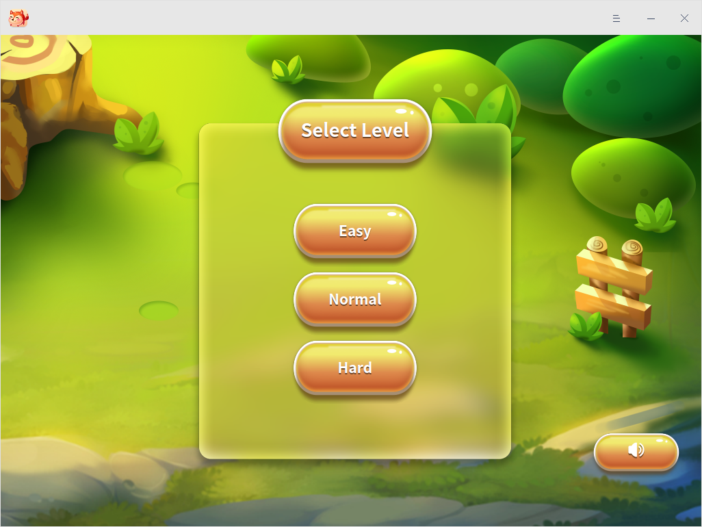
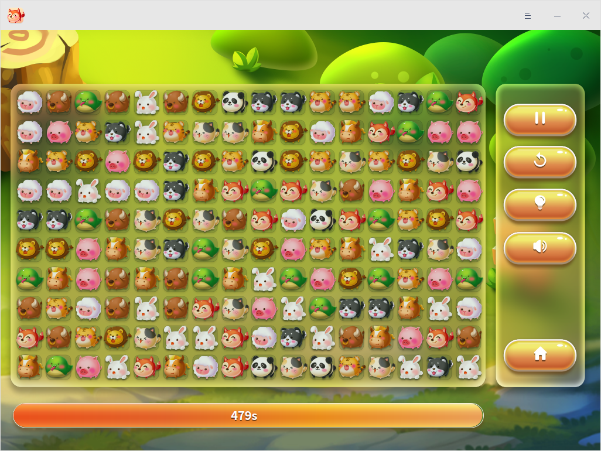

# Lianliankan|deepin-lianliankan|

## Overview

Lianliankan is a leisure puzzle game based on the connection and elimination of two same  patterns with easy rules and different levels and is able to satisfy your entertainment and relaxation needs in the debris time.

## Guides

You can run, close, and create shortcuts for Lianliankan in the following ways.

### Run Lianliankan

1. Click the Launcher icon  in the Dock and enter the Launcher interface.
2. Locate Lianliankan  by scrolling the mouse wheel or searching "lianliankan" in the Launcher interface and click it to run. 
3. Right-click  and you can:
 - Click **Send to desktop** to create a desktop shortcut.
 - Click **Send to dock** to fix the application in the Dock.
 - Click **Add to startup** to add the application to startup and it will automatically run when the system starts up.

### Exit Lianliankan

- On the home interface, clickto exit Lianliankan.

- Right-click  in the Dock and select **Close All** to exit Lianliankan.
- On the Lianliankan interface, click  and select **Exit** to exit Lianliankan.

  

## Rules

Eliminate the two same patterns connected by at most three straight lines and eliminate all the patterns in the interface within the given time to finish the round of game successfully.

## Basic Operations

1. On the home page, select the game level, easy, normal or hard level corresponding with different durations 480s, 320s and 160s respectively. 

   

2. Click  to start the game on the game interface.

   

3. You can also perform the other operations by clicking the icons listed in the table below.

<table class=block1>
<tr>
    <td>Icon</td>
    <td>Description</td>
    <td>Icon</td>
    <td>Description</td>
</tr>
<tr>
   <td></td>
   <td>Start/Pause the game</td>
   <td></td>
   <td>Shuffle the patterns</td>
</tr>
<tr>
   <td></td>
   <td>Game tips </td>
   <td></td>
   <td>Sound effect of the game </td>
</tr>
<tr>
   <td></td>
   <td>Return to the home page to select the game level</td>
   <td></td>
   <td></td>
</tr>
</table>

## Main Menu

In the main menu, you can switch window themes, view help manual, and get more information about Lianliankan.

### Theme

The window theme provides three theme types, namely Light Theme, Dark Theme, and System Theme.

1.  On the Lianliankan interface, click .
2.  Click **Theme** to choose one theme.

### Help

1.  On the Lianliankan interface, click .
2.  Click **Help** to view the manual of Lianliankan.

### About

1.  On the Lianliankan interface, click .
2.  Click **About** to view the version and introduction of Lianliankan.

### Exit

1.  On the Lianliankan interface, click .
2.  Click **Exit** to exit Lianliankan.

