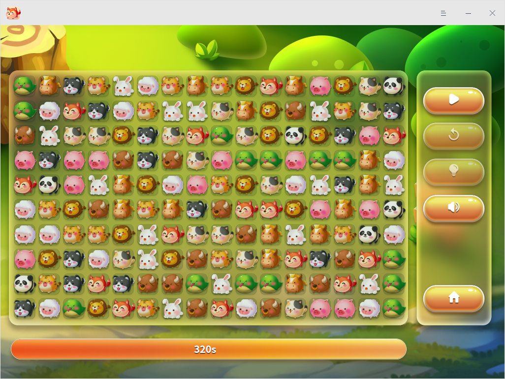

# 连连看|deepin-lianliankan|

## 概述

连连看是一款以连线消除法为主的休闲益智类的游戏，规则简单，难易可选，满足您在碎片时间中娱乐放松的需求。

## 使用入门

通过以下方式运行或关闭连连看，或者创建连连看的快捷方式。

### 运行连连看

1. 单击任务栏上的启动器图标 ，进入启动器界面。
2. 上下滚动鼠标滚轮浏览或通过搜索，找到连连看图标  ，单击运行。
3. 右键单击 ，您可以：
 - 单击 **发送到桌面**，在桌面创建快捷方式。
 - 单击 **发送到任务栏**，将应用程序固定到任务栏。
 - 单击 **开机自动启动**，将应用程序添加到开机启动项，在电脑开机时自动运行该应用。

### 关闭连连看

- 在连连看界面，单击 ，退出连连看。
- 在任务栏右键单击 ，选择 **关闭所有**，退出连连看。
- 在连连看界面，单击 ， 选择 **退出**，退出连连看。

## 游戏规则  

将相同的两张图案用三根以内的直线连在一起消除，并在规定的时间内消除所有的图案，便成功完成一轮游戏。

## 操作介绍

1. 在应用主界面中选择难度模式，不同的模式对应的游戏时长也不同，初级为480秒、中级为320秒、高级为160秒。

   

2. 进入游戏界面后，单击开始  按钮，开始游戏。

   

3. 您还可以单击如下表格中的按钮进行其他操作。

<table class=block1>
<tr>
    <td>图标</td>
    <td>说明</td>
    <td>图标</td>
    <td>说明</td>
</tr>
<tr>
   <td></td>
   <td>开始/暂停游戏</td>
   <td></td>
   <td>重置图案位置</td>
</tr>
<tr>
   <td></td>
   <td>游戏提示 </td>
   <td></td>
   <td>游戏音效开关 </td>
</tr>
<tr>
   <td></td>
   <td>回到主界面，重新设置难度模式</td>
   <td></td>
   <td></td>
</tr>
</table>

## 主菜单

在主菜单中，您可以切换窗口主题、查看帮助手册，了解连连看的更多信息。

### 主题

窗口主题包含浅色主题、深色主题和系统主题。

1. 在连连看界面，单击 。
2. 选择 **主题**，选择一个主题颜色。

### 帮助

查看帮助手册，进一步了解和使用连连看。

1. 在连连看界面，单击 。
2. 选择 **帮助**。
3. 查看连连看的帮助手册。

### 关于

1. 在连连看界面，单击 。
2. 选择 **关于**。
3. 查看连连看的版本和介绍。

### 退出

1. 在连连看界面，单击 。
2. 选择 **退出**。