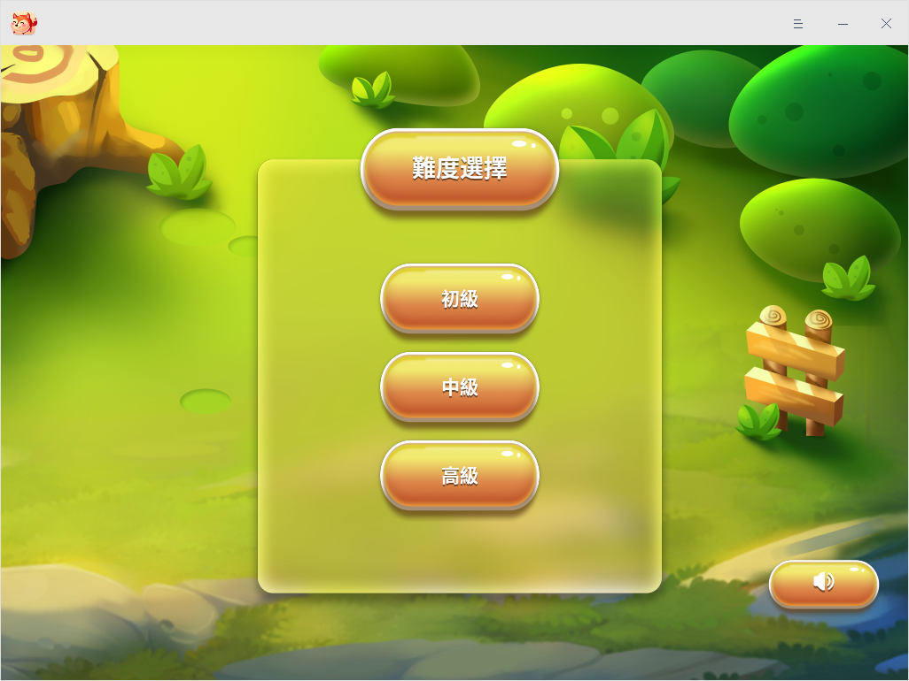

# 連連看|deepin-lianliankan|

## 概述

連連看是一款以連線消除法為主的休閒益智類的遊戲，規則簡單，難易可選，滿足您在碎片時間中娛樂放鬆的需求。

## 使用入門

通過以下方式運行或關閉連連看，或者創建連連看的快捷方式。

### 運行連連看

1. 單擊任務欄上的啟動器圖標 ，進入啟動器界面。
2. 上下滾動鼠標滾輪瀏覽或通過搜索，找到連連看圖標  ，單擊運行。
3. 右鍵單擊 ，您可以：
 - 單擊 **發送到桌面**，在桌面創建快捷方式。
 - 單擊 **發送到任務欄**，將應用程序固定到任務欄。
 - 單擊 **開機自動啟動**，將應用程序添加到開機啟動項，在電腦開機時自動運行該應用。

### 關閉連連看

- 在連連看界面，單擊 ，退出連連看。
- 在任務欄右鍵單擊 ，選擇 **關閉所有**，退出連連看。
- 在連連看界面，單擊 ， 選擇 **退出**，退出連連看。

  

## 遊戲規則  

將相同的兩張圖案用三根以內的直線連在一起消除，並在規定的時間內消除所有的圖案，便成功完成一輪遊戲。

## 操作介紹

1. 在應用主界面中選擇難度模式，不同的模式對應的遊戲時長也不同，初級為480秒、中級為320秒、高級為160秒。

   

2. 進入遊戲界面後，單擊開始  按鈕，開始遊戲。

   

3. 您還可以單擊如下表格中的按鈕進行其他操作。

<table class=block1>
<tr>
    <td>圖標</td>
    <td>說明</td>
    <td>圖標</td>
    <td>說明</td>
</tr>
<tr>
   <td></td>
   <td>開始/暫停遊戲</td>
   <td></td>
   <td>重置圖案位置</td>
</tr>
<tr>
   <td></td>
   <td>遊戲提示 </td>
   <td></td>
   <td>遊戲音效開關 </td>
</tr>
<tr>
   <td></td>
   <td>回到主界面，重新設置難度模式</td>
   <td></td>
   <td></td>
</tr>
</table>

## 主菜單

在主菜單中，您可以切換窗口主題、查看幫助手冊，了解連連看的更多訊息。

### 主題

窗口主題包含淺色主題、深色主題和系統主題。

1. 在連連看界面，單擊 。
2. 選擇 **主題**，選擇一個主題顏色。

### 幫助

查看幫助手冊，進一步了解和使用連連看。

1. 在連連看界面，單擊 。
2. 選擇 **幫助**。
3. 查看連連看的幫助手冊。

### 關於

1. 在連連看界面，單擊 。
2. 選擇 **關於**。
3. 查看連連看的版本和介紹。

### 退出

1. 在連連看界面，單擊 。
2. 選擇 **退出**。